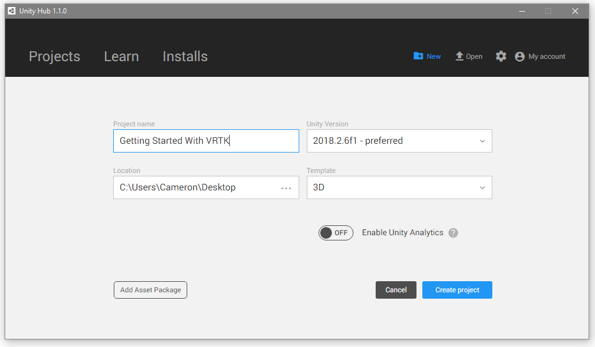
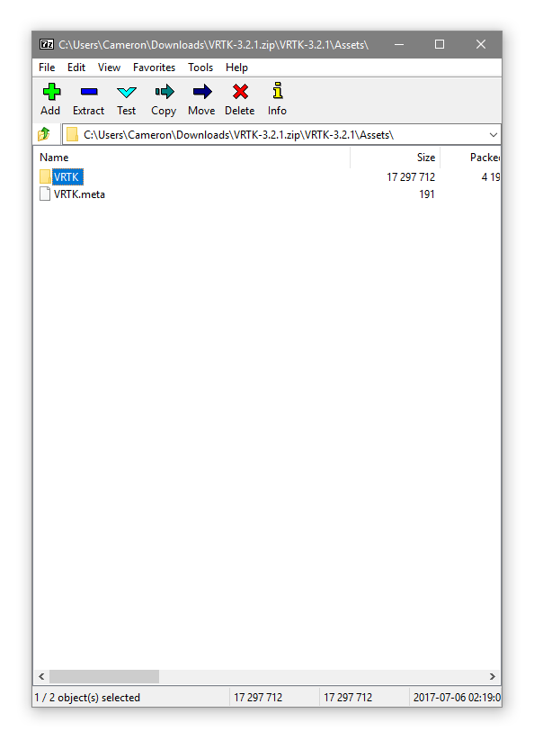
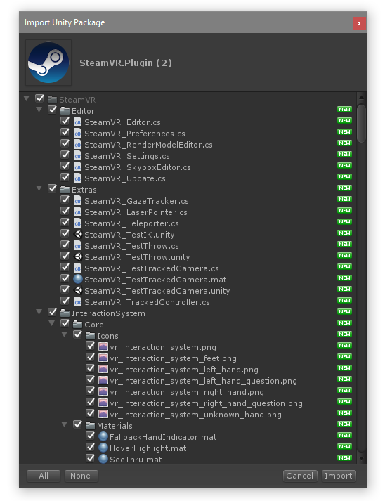
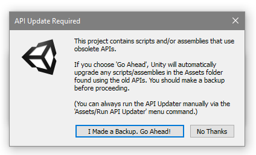
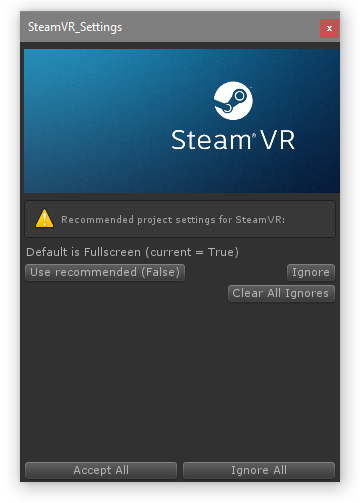
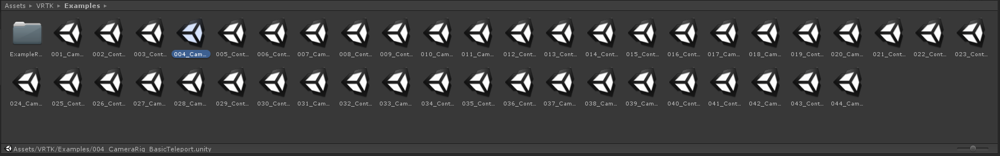
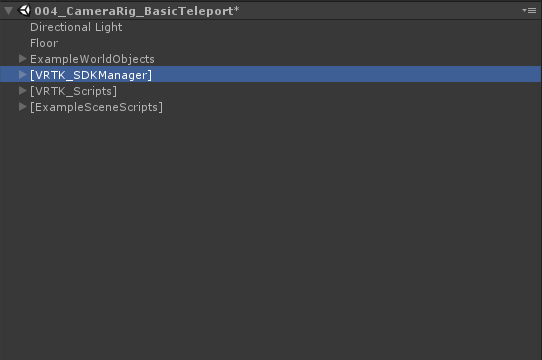
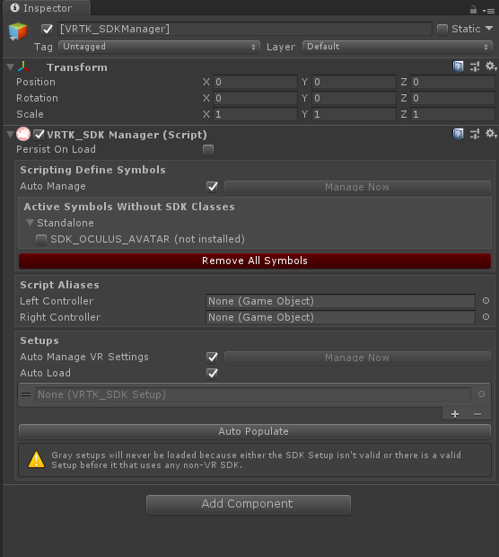

# Getting Started With VRTK For VR Development

<span style="display:block;text-align:center">We started off by creating a new unity project. I am using [Unity Hub](https://public-cdn.cloud.unity3d.com/hub/prod/UnityHubSetup.exe) to do this but it works in the normal unity launcher as well. I suggest using Unity 2018.2.6f1 (Latest Version at the time of writing this).



Next we will need to install VRTK (as of writing VRTK from the asset store doesn't work) so we are going to need to get it from github. We are also going to grab the SteamVR plugin so we can build our game for multiple VR headsets.

- [VRTK](https://github.com/thestonefox/VRTK/archive/3.2.1.zip)
- [SteamVR](https://github.com/ValveSoftware/steamvr_unity_plugin/releases/download/1.2.3/SteamVR.Plugin.unitypackage)

Now we will open the VRTK zip file and extract VRTK-3.2.1.zip>VRTK-3.2.1>Assets and put the VRTK folder into your Assets folder.



Then open the SteamVR.Plugin.unitypackage. If you have unity open already you will see a popup that looks like this.



Just click import and we will move on. If you get the following popup just click "I Made a Backup"



Then you will get this popup, just click Accept All.



Now we are going to open an example scene, to get how VRTK works. I'm going to open the example VRTK scene ```004_CameraRig_BasicTeleportation.unity```


Before starting the example click on the gameobject called ```[VRTK_SDKManager]```



Go to the inspector and click the ```Auto Populate``` Button to get your SDKs setup.



</span>